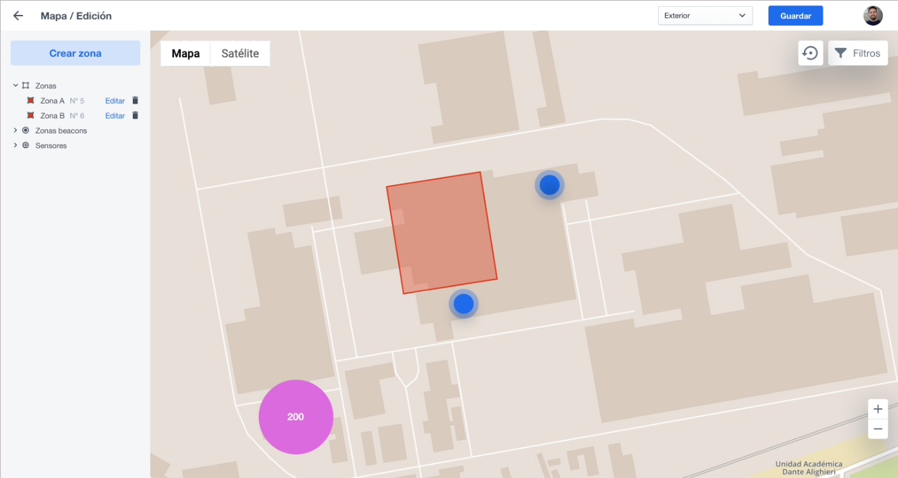
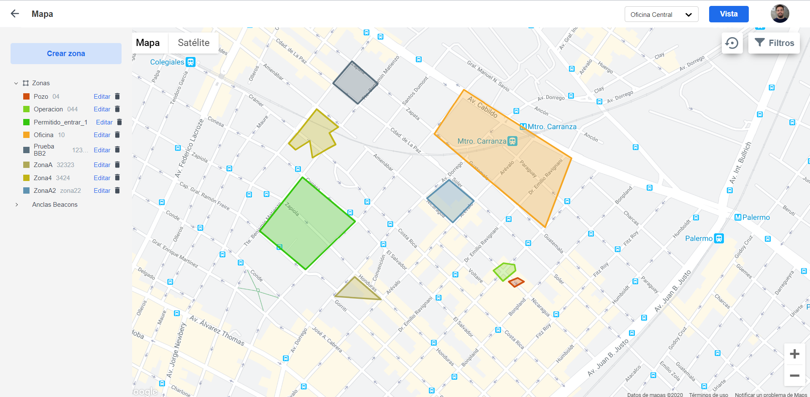
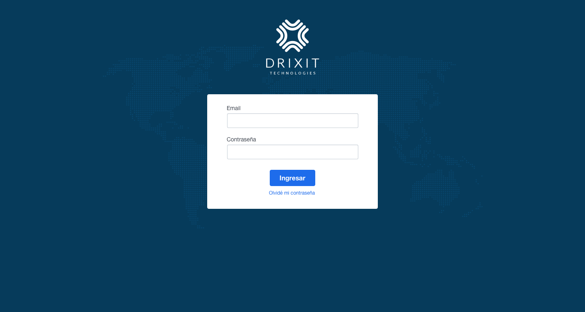

# Challenge QA Leader

### Objetivo
El presente ejercicio tiene una modalidad integradora en la que se busca entender mejor las capacidades del candidato y la capacidad de interpretación 

### Consigna

#### SECCIÓN A

A continuación se te presentarán 2 imágenes. Una será el diseño que el equipo de UX entregó a los desarrolladores y una segunda imagen en la cual se mostrará el diseño final implementado por el equipo de desarrollo.

**DISEÑO INICIAL (UX TEAM)**

**DISEÑO IMPLEMENTADO (DEV TEAM)**

En base a las imagenes enviadas te pedimos:

A.1 - Relevar los issues correspondientes y reportarlos en el board de tu repositorio. Nos interesa ver como los cargas y describis el error a reportar. La idea es simular una situación de trabajo del día a día.

A.2 - Realizar el reporte de los issues en inglés

A.3 - Detallar brevemente el proceso para la detección de issues y consideraciones a la hora de reportarlos. Indicar los pasos de manera que quede claro cómo es tu proceso de testeo

A.4 - Si encontrases un bug en la plataforma que no podés reproducir de manera consistente, cómo lo reportarías? Explicar con ejemplos

A.5 - Con que parámetros/lógica priorizas un bug detectado?

A.6 - Consideras a algunos de los issues relevados previamente como BLOQUEANTE? Indica por favor cual/es y porqué.

#### SECCIÓN B

B.1 - Cuales serían los test cases que harías para una pantalla de login?

B.2 - Como automatizarías el proceso de testing para esta pantalla?

B.3 - Generar el código asociado comentandolo y explicandolo en detalle con comentarios dentro del mismo.

**Aclaración**: Para el punto anterior se puede utilizar cualquier tipo de lenguaje o framework

B.4 - En que casos consideras útil/necesario aplicar tests de automatización?

#### BONUS POINTS

BP.1 - Cómo medirías que tan efectivo es el testeo tuyo o de tu equipo? Qué métricas usarías?

### Metodología de entrega
- Crear un nuevo repo en tu GitHub personal y realiza el ejercicio ahí mismo
- Una vez finalizado darle acceso a @gadots y @gonpombo8 para la revisión del mismo

### Cosideraciones Finales 

Este ejercicio no tiene un tiempo máximo de entrega, lo que si te pedimos es que **dentro de las 48hs de recibido nos indiques para cuando lo vas a tener finalizado**. Te invitamos a que seas vos quien ponga la fecha máxima de entrega.

Cualquier duda que tengas estamos disponibles!

Saludos y suerte!
